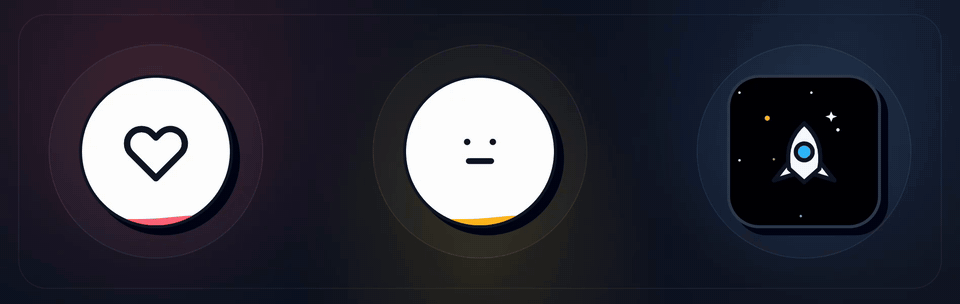

<h1 align="center">React Like Button</h1>

<p align="center">
  <strong>An animated reaction button for React.</strong><br />
  Use one click or several to fill up the button, then customize the fill, particles, shape, icon, and cursor.
</p>

<p align="center">
  <a href="https://www.npmjs.com/package/@fmarlats/react-like-button"></a>
  <a href="https://bundlephobia.com/package/@fmarlats/react-like-button"></a>
  <a href="https://www.typescriptlang.org/"></a>
  <a href="https://opensource.org/licenses/MIT"></a>
</p>

<p align="center">
  <a href="https://stackblitz.com/edit/react-like-button-component?file=src%2FApp.tsx"><strong>Try the interactive playground →</strong></a>
  ·
  <a href="https://www.npmjs.com/package/@fmarlats/react-like-button">View on npm</a>
</p>

<p align="center">
  
</p>

<p align="center"><sub>The preview GIF is compressed so looks choppy. It will be fluid in real use.</sub></p>

Use it for likes, dislikes, favorites, ratings, feedback, or your own reaction type. Both Tailwind CSS and vanilla CSS versions are included, with the same TypeScript API.

## What it supports

- Single-click and multi-click reactions
- Controlled and uncontrolled state
- Animated fill with optional waves
- Five built-in particle effects, each customizable
- Custom button shapes, icons, cursors, colors, and borders
- Keyboard controls and ARIA attributes
- Tailwind CSS and vanilla CSS components

## Installation

```bash
npm install @fmarlats/react-like-button
# or
yarn add @fmarlats/react-like-button
# or
pnpm add @fmarlats/react-like-button
```

## Quick Start

### Tailwind CSS Version

```tsx
import { LikeButton } from '@fmarlats/react-like-button';
import '@fmarlats/react-like-button/like-button.css'; // Required for animations

function App() {
  return (
    <LikeButton
      onClick={(clicks) => console.log('Total clicks:', clicks)}
      particlePreset="burst"
    />
  );
}
```

### Vanilla CSS Version

```tsx
import { LikeButtonVanilla } from '@fmarlats/react-like-button';
import '@fmarlats/react-like-button/styles.css';

function App() {
  return (
    <LikeButtonVanilla
      onClick={(clicks) => console.log('Total clicks:', clicks)}
      particlePreset="confetti"
    />
  );
}
```

## Particle Effects

### Disable Particles

```tsx
// Disable particle effects entirely
<LikeButton showParticles={false} />
```

### Disable Wave Animation

```tsx
// Disable wave animation (flat fill color)
<LikeButton showWaves={false} />

// Disable both waves and particles for a minimal look
<LikeButton showWaves={false} showParticles={false} />
```

### Built-in Presets

Five presets are included:

```tsx
// Quick explosion of hearts (12 particles)
<LikeButton particlePreset="burst" />

// Upward spray effect (10 particles)
<LikeButton particlePreset="fountain" />

// Colorful celebration (15 particles)
<LikeButton particlePreset="confetti" />

// Subtle floating effect (6 particles)
<LikeButton particlePreset="gentle" />

// Explosive sparkles (16 particles)
<LikeButton particlePreset="fireworks" />
```

### Custom Particle Configuration

Override particle behavior with `particleConfig`:

```tsx
<LikeButton particleConfig={{
  shape: 'star',                        // 'heart' | 'star' | 'circle' | 'square' | 'sparkle'
  colors: ['#FFD700', '#FFA500'],       // Array of colors
  count: 15,                            // Number of particles
  speed: 600,                           // Animation duration (ms)
  distance: { min: 80, max: 120 },      // Travel distance (px)
  spread: 180,                          // Spread angle (degrees)
  spreadOffset: -90,                    // Starting angle (0=right, 90=down, 180=left, 270=up)
  size: { min: 1.2, max: 2.0 },         // Size range (scale multiplier)
  easing: 'cubic-bezier(0.22, 1, 0.36, 1)',  // CSS easing function
  fadeOut: true                         // Fade out during animation
}} />
```

### Combine Preset with Custom Config

You can also start with a preset and override only what you need:

```tsx
<LikeButton 
  particlePreset="burst" 
  particleConfig={{ 
    count: 20,
    colors: ['#ff0000', '#00ff00', '#0000ff']
  }} 
/>
```

## Basic Usage

### Click Tracking

```tsx
<LikeButton
  maxClicks={10}
  onClick={(clicks) => console.log('Clicks:', clicks)}
  onRightClick={(clicks) => console.log('Right click at:', clicks)}
/>
```

### Uncontrolled with Initial Value

```tsx
// Start with 3 clicks already filled
<LikeButton defaultClicks={3} maxClicks={10} />
```

### Controlled Mode

```tsx
const [clicks, setClicks] = useState(0);

// Using onChange (simpler, ideal for state setters)
<LikeButton
  clicks={clicks}
  onChange={setClicks}
  maxClicks={5}
/>

// Using onClick (when you need the event)
<LikeButton
  clicks={clicks}
  onClick={(newClicks, event) => {
    setClicks(newClicks);
    event.stopPropagation();
  }}
  maxClicks={5}
/>
```

### Custom Colors

```tsx
<LikeButton 
  fillColor="#ff0000"
  waveColor="#ff6666"
  size={120}
/>
```

### Custom Shapes

```tsx
// Built-in shapes
<LikeButton shape="circle" />
<LikeButton shape="rounded" />

// Custom clip-path
<LikeButton shape={{ 
  clipPath: "polygon(50% 0%, 100% 50%, 50% 100%, 0% 50%)" 
}} />
```

### Custom Cursors

```tsx
// Built-in cursor presets
<LikeButton cursor="heart" />
<LikeButton cursor="star" />
<LikeButton cursor="thumbs-up" />
<LikeButton cursor="pointer" />

// Custom cursor
<LikeButton cursor={{
  url: "data:image/svg+xml;...",
  hotspotX: 16,
  hotspotY: 16,
  fallback: "pointer"
}} />
```

## Advanced Examples

### Celebration Button

A larger confetti burst for achievements or milestones:

```tsx
<LikeButton
  particlePreset="confetti"
  particleConfig={{
    count: 25,
    speed: 1000,
    distance: { min: 100, max: 150 }
  }}
  fillColor="#FFD700"
  size={100}
/>
```

### Upvote Button

An upvote button with an upward fountain effect:

```tsx
<LikeButton
  particlePreset="fountain"
  particleConfig={{
    colors: ['#FF4500'],
    shape: 'star'
  }}
  fillColor="#FF4500"
  shape="rounded"
/>
```

### Subtle Favorite

A smaller, slower effect for favorites:

```tsx
<LikeButton
  particlePreset="gentle"
  particleConfig={{
    colors: ['#FFB6C1', '#FFC0CB'],
    fadeOut: true
  }}
  fillColor="#FFB6C1"
/>
```

### Custom Shape Particles

Particle shapes can be React render functions:

```tsx
import type { CustomParticleShape } from '@fmarlats/react-like-button';

const customDiamond: CustomParticleShape = {
  render: ({ size, color, className }) => (
    <svg width={size} height={size} className={className} viewBox="0 0 24 24">
      <path d="M12 2 L22 12 L12 22 L2 12 Z" fill={color} />
    </svg>
  )
};

<LikeButton particleConfig={{ shape: customDiamond }} />
```

## API Reference

### LikeButton Props

| Prop | Type | Default | Description |
|------|------|---------|-------------|
| `size` | `number` | `96` | Button size in pixels |
| `fillColor` | `string` | `"#EF4444"` | Fill color (hex or CSS color) |
| `waveColor` | `string` | `"#B91C1C"` | Back wave color |
| `maxClicks` | `number` | `1` | Maximum number of clicks allowed |
| `clicks` | `number` | - | Controlled mode: current click count |
| `defaultClicks` | `number` | `0` | Initial clicks for uncontrolled mode |
| `disabled` | `boolean` | At maximum | Override the automatic disabled state |
| `ariaLabel` | `string \| (state) => string` | Generated | Static or state-based accessible label |
| `onChange` | `(clicks: number) => void` | - | Called with new count (ideal for `setClicks`) |
| `onClick` | `(clicks: number, event) => void` | - | Click handler with event access |
| `onRightClick` | `(clicks: number, event) => void` | - | Right-click handler |
| `className` | `string` | `""` | Additional button class name |
| `shape` | `ShapePreset \| CustomShape` | `"circle"` | Button shape |
| `cursor` | `CursorPreset \| CustomCursor` | `"heart"` | Cursor style |
| `styles` | `StyleOverrides` | `{}` | Custom style overrides |
| `renderIcon` | `((props) => ReactNode) \| null` | Heart icon | Custom icon renderer |
| `minFillPercent` | `number` | `0` | Minimum fill percentage |
| `showParticles` | `boolean` | `true` | Enable/disable particle effects |
| `showWaves` | `boolean` | `true` | Enable/disable wave animation on fill |
| `particlePreset` | `ParticlePreset` | - | Particle effect preset |
| `particleConfig` | `ParticleConfig` | - | Custom particle configuration |

### ParticleConfig

| Property | Type | Default | Description |
|----------|------|---------|-------------|
| `shape` | `ParticleShape` | `'heart'` | Particle shape |
| `colors` | `string[]` | `['#EF4444', '#B9FF14', '#3B82F6']` | Particle colors |
| `count` | `number` | `8` | Number of particles |
| `size` | `number \| Range` | `{ min: 1.0, max: 1.5 }` | Size multiplier |
| `speed` | `number` | `500` | Animation duration (ms) |
| `distance` | `number \| Range` | `{ min: 60, max: 100 }` | Travel distance (px) |
| `spread` | `number` | `360` | Spread angle (degrees) |
| `spreadOffset` | `number` | `0` | Starting angle offset |
| `easing` | `string` | `'cubic-bezier(0.22, 1, 0.36, 1)'` | CSS easing |
| `fadeOut` | `boolean` | `true` | Fade out animation |

### ParticlePreset

| Preset | Shape | Count | Description |
|--------|-------|-------|-------------|
| `'burst'` | ❤️ heart | 12 | Quick explosion in all directions |
| `'fountain'` | ⚫ circle | 10 | Upward spray effect |
| `'confetti'` | ◼️ square | 15 | Colorful celebration |
| `'gentle'` | ❤️ heart | 6 | Subtle floating effect |
| `'fireworks'` | ✨ sparkle | 16 | Explosive sparkles |

### ParticleShape

- `'heart'` - Heart shape ❤️
- `'star'` - Star shape ⭐
- `'circle'` - Circle shape ⚫
- `'square'` - Square shape ◼️
- `'sparkle'` - Sparkle shape ✨
- `CustomParticleShape` - Custom shape object

## Examples

Check out the [examples](./examples) directory for more usage examples.

## Browser support

The component uses standard CSS transitions, transforms, and SVG. It is intended for current versions of Chrome, Edge, Firefox, Safari, iOS Safari, and Chrome for Android.

## Performance

Particle movement uses CSS transforms, and particles are removed from the DOM when their animation finishes. For buttons that are clicked often, keep `particleConfig.count` low.

## Accessibility

- ARIA labels for screen readers
- Keyboard support (Enter/Space to click)
- Particles marked as decorative (`aria-hidden="true"`)
- Shift+Enter triggers right-click action for keyboard users

## TypeScript

The package exports its component, hook, shape, cursor, and particle types:

```tsx
// Most common types
import type {
  LikeButtonProps,          // Component props
  IconRenderProps,          // Custom icon render function props
  ParticleConfig,           // Particle configuration
  CustomParticleShape,      // Custom particle shape
} from '@fmarlats/react-like-button';

// Hook types (for headless usage)
import type {
  UseLikeButtonOptions,     // Hook options
  UseLikeButtonReturn,      // Hook return type
} from '@fmarlats/react-like-button';

// Shape and cursor types
import type {
  Shape, ShapePreset, CustomShape,
  Cursor, CursorPreset, CustomCursor,
} from '@fmarlats/react-like-button';

// All particle types
import type {
  ParticlePreset, ParticleShape, ParticleShapePreset,
  ParticleShapeProps, Range,
} from '@fmarlats/react-like-button';
```

## Contributing

Contributions are welcome. Open an issue or pull request on GitHub.

## License

MIT

## Credits

Created by [Florian MARLATS](https://github.com/fmarlats)

## Support

- [Report a bug](https://github.com/fmarlats/react-like-button/issues)
- [Request a feature](https://github.com/fmarlats/react-like-button/issues)
- [Star the repository](https://github.com/fmarlats/react-like-button)
